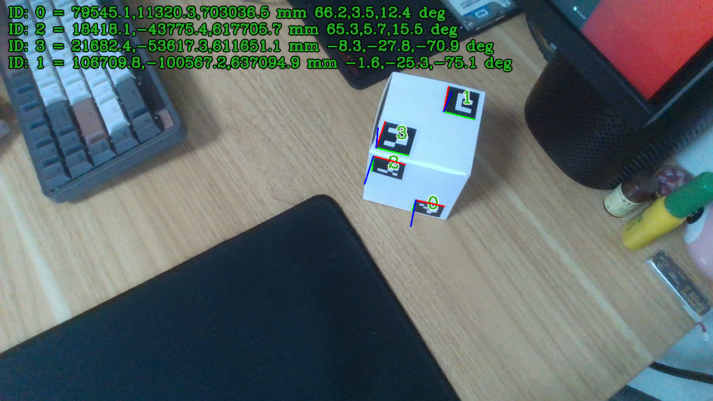
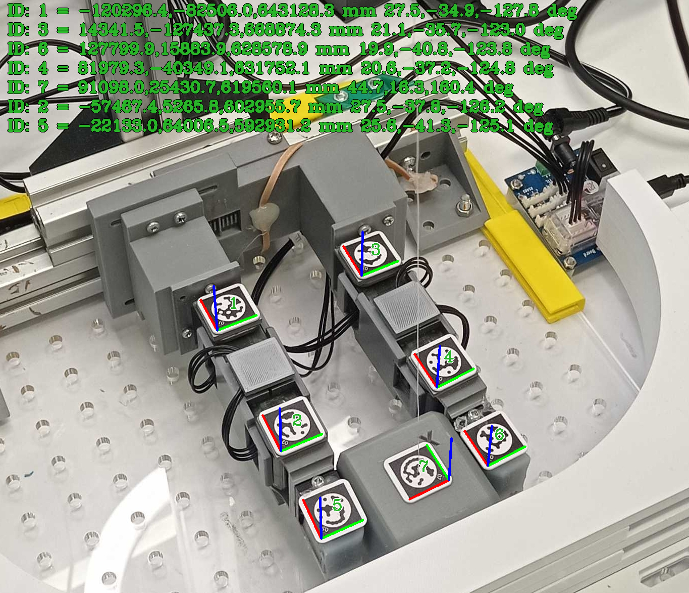
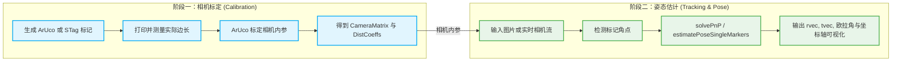
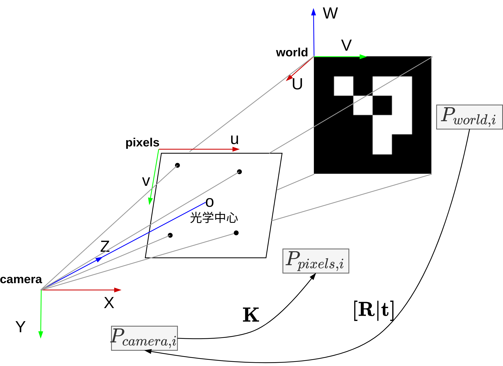

# 🎯 6D Pose Estimation

[](https://www.microsoft.com/windows)
[](https://ubuntu.com/)
[](https://en.cppreference.com/w/cpp/11)
[](https://cmake.org/)
[](https://opencv.org/)
[](https://github.com/IntelRealSense/librealsense)
[](https://www.orbbec.com/)

`pose6d_estimation` 是一个基于 `ArUco` 与 `STag` 标记码完成实时检测（支持[](https://www.orbbec.com/)以及[](https://github.com/IntelRealSense/librealsense)相机）与高精度 **6自由度 (6DoF)** 位姿估计的 **[](https://cmake.org/)** 工程，支持在[](https://ubuntu.com/)以及[](https://www.microsoft.com/windows)平台编译运行，仓库包含两套功能模块：

- `aruco/`：ArUco 制码、相机标定、位姿估计
- `stag/`：STag 制码、位姿估计

当前仓库只支持从根目录统一编译。

| ArUco | STag |
| --- | --- |
|  |  |

## 🧭 目录结构

```shell
pose6d_estimation/
├── CMakeLists.txt
├── README.md
├── assets/                   # 公共图片资源：PnP原理 / 棋盘格 / 非对称圆点阵图片
├── 3rdparty/                 # 共享 OpenCV / RealSense / Orbbec / STag 依赖
├── common/
│   └── camera/               # 共享相机抽象层
├── scripts/                  # 统一依赖安装脚本
│   ├── build_opencv.sh       # opencv库编译脚本-Linux
│   ├── build_realsense.sh    # realsense相机库编译脚本-Linux
│   ├── build_orbbec.sh       # orbbec相机库编译脚本-Linux
│   ├── build_stag.sh         # stag库编译脚本-Linux
│   ├── install_opencv.bat    # opencv库编译脚本-Windows
│   ├── install_realsense.bat # realsense相机库编译脚本-Windows
│   ├── install_orbbec.bat    # orbbec相机库编译脚本-Windows
│   └── install_stag.bat      # stag库编译脚本-Windows
├── aruco/
│   ├── CMakeLists.txt
│   ├── README.md
│   ├── calib/                # arucoCalib 源码
│   ├── generator/            # arucoMarkerGen 源码
│   └── pose/                 # arucoMarkerPose 源码
└── stag/
    ├── CMakeLists.txt
    ├── README.md
    ├── generator/            # stagMarkerGen 源码
    └── pose/                 # stagMarkerPose 源码
```

## 🧱 工程组织

- 共享依赖目录：`3rdparty/`
- 共享相机接口：`common/camera/`
- 共享脚本入口：`scripts/`
- 公共图示资源：`assets/`

`aruco` 与 `stag` 都直接复用这些公共层。

## 📦 依赖准备

推荐在仓库根目录执行统一脚本。

Ubuntu:

```bash
cd pose6d_estimation
bash scripts/build_opencv.sh
bash scripts/build_realsense.sh
bash scripts/build_orbbec.sh
bash scripts/build_stag.sh
```

Windows:

```powershell
cd pose6d_estimation
.\scripts\install_opencv.bat
.\scripts\install_realsense.bat
.\scripts\install_orbbec.bat
.\scripts\install_stag.bat
```

共享依赖安装位置：

- `3rdparty/opencv`
- `3rdparty/realsense`
- `3rdparty/orbbec`
- `3rdparty/stag`

## 💻 Windows 安装注意事项

Windows 下建议提前准备以下环境：

- `CMake`
  下载[Cmake](https://github.com/Kitware/CMake/releases/download/v4.3.2/cmake-4.3.2-windows-x86_64.msi)，安装完成后，需要加入系统 `Path`，例如 `C:\Program Files\CMake\bin`
- `MinGW` 或 `Visual Studio`
  下载[MinGW](https://github.com/niXman/mingw-builds-binaries/releases/download/16.1.0-rt_v14-rev0/x86_64-16.1.0-release-win32-seh-ucrt-rt_v14-rev0.7z)，解压后，MinGW 需要把 `mingw64\bin` 加入 `Path`
- `curl`、`tar`、`PowerShell`
  安装脚本会用它们下载和解压依赖

建议：

- 使用 `MinGW Makefiles` 时，确保 `cmake` 与 `mingw32-make` 来自同一套环境
- 使用 `Visual Studio` 时，建议安装 “使用 C++ 的桌面开发” 工作负载
- 如果运行时报缺少 DLL，优先检查 `3rdparty/opencv`、`3rdparty/realsense`、`3rdparty/orbbec` 是否完整安装
- 如果系统里有多套 `MinGW`，优先保证运行时和编译时使用同一套 `libstdc++/libgcc`

## 🛠️ 编译

Linux:

```bash
cd pose6d_estimation
mkdir -p build
cd build
cmake ..
make -j4
```

Windows MinGW:

```powershell
cd pose6d_estimation
mkdir build
cd build
cmake .. -G "MinGW Makefiles"
mingw32-make -j4
```

Windows Visual Studio:

```powershell
cd pose6d_estimation
mkdir build
cd build
cmake .. -G "Visual Studio 17 2022" -A x64
cmake --build . --config Release
```

只构建单套工具：

```bash
cmake .. -DBUILD_ARUCO_TOOLS=ON -DBUILD_STAG_TOOLS=OFF
cmake .. -DBUILD_ARUCO_TOOLS=OFF -DBUILD_STAG_TOOLS=ON
```

## 🚀 运行

```bash
# ArUco
cd build/aruco/generator && ./arucoMarkerGen
cd build/aruco/calib && ./arucoCalib
cd build/aruco/pose && ./arucoMarkerPose

# STag
cd build/stag/generator && ./stagMarkerGen
cd build/stag/pose && ./stagMarkerPose
```

图片模式：

```bash
./arucoMarkerPose ./sample.png ./intrinsic_calib.yaml
./stagMarkerPose ./sample.png ./intrinsic_calib.yaml
```

## 🔁 默认流程



推荐流程：

1. 用 `aruco/generator` 或 `stag/generator` 生成标记
2. 打印后测量真实边长
3. 用 `aruco/calib` 标定内参
4. 把标定结果给 `aruco/pose` 或 `stag/pose`
5. 使用图片模式或实时相机模式进行位姿估计

## 🧮 PnP 位姿估计原理

位姿估计的核心是 `PnP` 问题：已知相机内参 $K$、畸变参数、标记物实际边长，以及标记角点在图像中的像素坐标，求解标记相对于相机的 6DoF 位姿。



- **世界坐标系 ($P_{world}$)**：在标记平面上定义的 3D 坐标系，四个角点的 3D 坐标由实际边长唯一确定。
- **相机坐标系 ($P_{camera}$)**：以相机光心为原点的 3D 坐标系。
- **像素坐标系 ($P_{pixels}$)**：图像平面中的 2D 坐标系，角点检测结果直接落在这里。

整体投影关系映射如下：

$$
\mathbf{P}_{world} \xrightarrow{[\mathbf{R}|\mathbf{t}]} \mathbf{P}_{camera} \xrightarrow{\mathbf{K}} \mathbf{P}_{pixels}
$$

### Step 1: 世界坐标到相机坐标

利用外参矩阵 $[\mathbf{R}|\mathbf{t}]$ 将标记平面的 3D 点变换到相机坐标系：

$$
\mathbf{P}_{camera} = \mathbf{R} \cdot \mathbf{P}_{world} + \mathbf{t}
$$

- $\mathbf{R}$：旋转矩阵
- $\mathbf{t}$：平移向量

### Step 2: 相机坐标到像素坐标

再利用相机内参矩阵 $\mathbf{K}$ 投影到图像平面：

$$
s \cdot \mathbf{p} = \mathbf{K} \cdot \mathbf{P}_{camera}
$$

$$
\mathbf{K} = \begin{bmatrix} f_x & 0 & c_x \\ 0 & f_y & c_y \\ 0 & 0 & 1 \end{bmatrix}
$$

其中：

- $f_x, f_y$ 是焦距
- $c_x, c_y$ 是主点
- $s$ 是尺度因子

### Step 3: 合并求解

结合上述步骤得到完整线性约束方程：

$$
s \begin{bmatrix} u \\ v \\ 1 \end{bmatrix} = \mathbf{K} \left( \mathbf{R} \begin{bmatrix} U \\ V \\ W \end{bmatrix} + \mathbf{t} \right)
$$

展开完整矩阵映射形式：

$$
s \begin{bmatrix} u \\ v \\ 1 \end{bmatrix} = \underbrace{\begin{bmatrix} f_x & 0 & c_x \\ 0 & f_y & c_y \\ 0 & 0 & 1 \end{bmatrix}}_{\mathbf{K} \text{ (内参)}} \underbrace{\begin{bmatrix} r_{11} & r_{12} & r_{13} & t_x \\ r_{21} & r_{22} & r_{23} & t_y \\ r_{31} & r_{32} & r_{33} & t_z \end{bmatrix}}_{[\mathbf{R}|\mathbf{t}] \text{ (外参)}} \begin{bmatrix} U \\ V \\ W \\ 1 \end{bmatrix}
$$

工程里对应实现：

- `ArUco`
  使用 `cv::aruco::detectMarkers` 与 `cv::aruco::estimatePoseSingleMarkers`
- `STag`
  使用 `stag::detectMarkers` 与 `cv::solvePnP`

## ⚙️ 配置重点

ArUco 位姿：

- `mode`: `camera` / `image`
- `camera_type`: `realsense` / `orbbec`
- `intrinsics_source`: `sdk` / `yaml`

STag 位姿：

- `mode`: `camera` / `image`
- `camera_type`: `realsense` / `orbbec`
- `intrinsics_source`: `sdk` / `yaml`
- `library_hd`: `11/13/15/17/19/21/23`

## 🖼️ 标定板资源

| 类型         | 图片                              |
| ------------ | --------------------------------- |
| 棋盘格       | `aruco/assets/chessboard_9x6.png` |
| 非对称圆点阵 | `aruco/assets/acircles_4x11.png`  |

## 📚 模块说明

- [aruco/README.md](./aruco/README.md)
- [stag/README.md](./stag/README.md)
